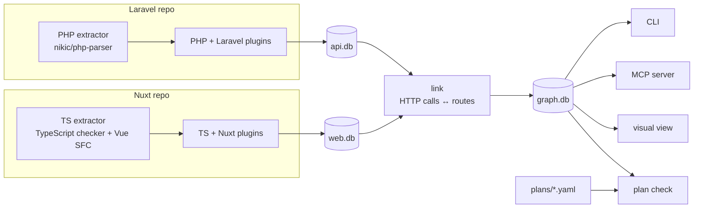

# code-graph

**A deterministic dependency graph for Laravel + Nuxt codebases, so you (and your AI agent) can see everything a change touches before you make it.**

Ask "what depends on this table, connection, config key or method?" and get every caller, route, command and page that
reaches it, each hop backed by `file:line` evidence. It runs locally, reads only source files and uses no LLM.

> **Status:** beta. Laravel (PHP) and Nuxt/Vue (TypeScript) are supported natively; other languages can be imported
> through SCIP. See [Limitations](#limitations).

[Quickstart](#quickstart-about-2-minutes-on-the-bundled-sample-apps) · [What you get](#what-you-get) · [Supported stacks](#supported-languages-and-frameworks) · [AI agents](#using-it-with-an-ai-agent) · [Docs](#documentation)

## Why

Say you need to change how stock is reserved from a second database, the `warehouse` connection. An agent (or a person
in a hurry) greps for `warehouse`, finds four files, edits them, and moves on. Grep can't tell you:

- that two public routes, `POST /v1/orders` and `POST /v1/stock/reserve`, reach that code through a service two calls
  away, in files that never say "warehouse";
- that the change has siblings: add a column in `Admin\BookController::store`, and the separate `update` path and
  the admin form still write `books` without it ([planned changes](#4-a-planned-change-layer) catch this);
- which callers run on every request and which are a one-off console command;
- that one route only touches the warehouse in a branch that is already dead behind a feature flag.

Semantic search has the opposite problem. It finds code that *looks* related, but it can't prove that a path exists.
code-graph builds the graph from parsers and the type checker (calls, routes, models, tables, columns, config, HTTP
calls from the frontend to backend routes), then answers with the paths themselves:

```text
$ cg reaches connection:warehouse table:warehouse_stock --db out/graph.db --no-paths   # abridged
== RUNTIME (reached from http_route / scheduled / queue_job / listener): 4 functions/methods
  [Http/Controllers]
    App\Http\Controllers\OrderController::store  depth=3 conf=resolved  http_route(1)
    App\Http\Controllers\StockController::reserve  depth=3 conf=resolved  http_route(1)
  [Services]
    App\Services\StockService::reserve  depth=2 conf=resolved  http_route(2)
    App\Services\StockService::reserveFromWarehouse  depth=1 conf=resolved  http_route(2)

== OPERATOR-ONLY (artisan_command / admin_panel; one-off import & provisioning): 1 functions/methods
  [Console/Commands]
    App\Console\Commands\SyncWarehouseCommand::handle  depth=1 conf=resolved  artisan_command(1)

== GATED UNDER SCENARIO 'new_inventory' (dead when the scenario holds; live otherwise): 1 functions/methods
  [Http/Controllers/Admin]
    App\Http\Controllers\Admin\InventoryController::index  gated_target  entry-when-off: http_route(1)
```

Every edge is either `exact` (syntactically certain), `resolved` (needed type or name resolution) or `heuristic`
(clearly labelled fallback), so you know how far to trust each answer.

## Quickstart (about 2 minutes, on the bundled sample apps)

The repo ships two small fictional apps: `examples/bookstore-api` (Laravel) and `examples/bookstore-web` (Nuxt).

**Prerequisites**

| tool | version | used for |
|---|---|---|
| Python | 3.11+ (tested with 3.13) | the indexer, CLI, MCP server |
| PHP + Composer | PHP 8.2+ (tested 8.4), Composer 2 | the PHP extractor (nikic/php-parser 5) |
| Node.js + npm | Node 20+ (tested 20.19) | the TypeScript/Vue extractor |

**Install** (about 15 seconds; all dependencies go inside the checkout):

```bash
git clone https://github.com/cyberchronos00/code-graph.git && cd code-graph
python3 -m venv .venv && .venv/bin/pip install "mcp>=2.2" pyyaml pytest protobuf
(cd codegraph/plugins/php/extractor && composer install)
(cd codegraph/plugins/ts/extractor && npm ci)
cg() { .venv/bin/python -m codegraph.cli "$@"; }    # shorthand used below
```

**Index both apps and link them into one graph** (a few seconds):

```bash
mkdir -p out
cg index examples/bookstore-api --name bookstore-api --gates examples/bookstore.gates.json --db out/api.db > out/api.stats.json
cg index examples/bookstore-web --name bookstore-web --db out/web.db > out/web.stats.json
cg link --backend out/api.db --frontend out/web.db \
        --backend-name bookstore-api --frontend-name bookstore-web --db out/graph.db > out/link.stats.json
```

**Ask it something:**

```bash
cg reaches connection:warehouse table:warehouse_stock --db out/graph.db   # who depends on the warehouse DB?
cg impact StockService::reserve --db out/graph.db                         # what calls this, from which routes?
cg path page:/reports/:id table:orders --db out/graph.db                  # frontend page -> DB table, hop by hop
cg resolutions timezone --db out/graph.db                                 # where is "timezone" decided?
cg plan check preorders --plans-dir examples/plans --db out/graph.db      # what does this planned change miss?
.venv/bin/python -m pytest -q tests/                                      # 31 tests, ~10 s
```

`scripts/reproduce.sh` runs the same steps end to end (into `out/graph.db`), and also writes HTML views and (if Chrome is installed)
screenshots to `out/`.

## What you get

### 1. A CLI for impact questions

`reaches`, `impact`, `downstream`, `path`, `writers`, `siblings` and `api-calls` all work on one SQLite graph, and
across repos once the frontend and backend are linked. Every hop shows its evidence:

```text
$ cg path page:/reports/:id table:orders --db out/graph.db
page:app/pages/reports/[id].vue
          -CALLS[resolved @ bookstore-web/app/pages/reports/[id].vue:10]-> function:app/composables/useReports.ts#useReports.fetchTop
          -HTTP_CALLS[resolved @ bookstore-web/app/composables/useReports.ts:9]-> http:GET /v1/main/admin/reports/top
          -MATCHES_ROUTE[resolved @ bookstore-api/routes/api.php:11]-> route:GET /v1/{store}/admin/reports/top
          -ROUTES_TO[exact @ bookstore-api/routes/api.php:11]-> method:App\Http\Controllers\ReportController::top
          -CALLS[resolved @ bookstore-api/app/Http/Controllers/ReportController.php:21]-> method:App\Services\SalesReportService::report
          -CALLS[exact @ bookstore-api/app/Services/SalesReportService.php:12]-> method:App\Services\SalesReportService::build
          -READS_COLUMN[resolved @ bookstore-api/app/Services/SalesReportService.php:19]-> column:orders.placed_at
```

It also traces *values*. `resolutions <concept>` finds every place a value is picked through a fallback chain, shows
where the chains disagree, and checks whether the frontend actually sends the key:

```text
$ cg resolutions timezone --db out/graph.db      # abridged
[A] input:timezone > column:orders.customer_timezone > setting:locale.timezone > column:stores.default_timezone > 'UTC'
[B] input:timezone > setting:reports.timezone > 'UTC'
  [A] vs [B]: same up to input:timezone; then [A] column:orders.customer_timezone vs [B] setting:reports.timezone
  GET /v1/main/admin/reports/top  -> chain B
       => 'timezone': never sent (builder key is conditional and no call site passes it)
```

Full reference: [docs/cli.md](docs/cli.md) · value facts: [docs/value-facts.md](docs/value-facts.md)

### 2. An MCP server for AI agents

The same queries as MCP tools (`reaches`, `impact`, `siblings`, `path`, `downstream`, `api_calls`, `resolutions`,
`plan_check`, `index`, …), so an agent can check the blast radius before it edits. It is stdio only and runs
locally:

```text
> impact(method="StockService::reserve")
transitive callers: 2; entry points: 2
## http_route (2)
  POST /v1/orders  ROUTES_TO@api.php:21 → CALLS@OrderController.php:17~r → Services\StockService::reserve
  POST /v1/stock/reserve  ROUTES_TO@api.php:19 → CALLS@StockController.php:16~r → Services\StockService::reserve
```

Setup: [Using it with an AI agent](#using-it-with-an-ai-agent) · all tools: [docs/mcp.md](docs/mcp.md)

### 3. A visual view

`cg serve --db out/graph.db --plans-dir examples/plans` starts a local, read-only web view at
`http://127.0.0.1:8177/`. It draws the same query results as a graph grouped by repo and module. Click a node to see
its source snippet and evidence edges. `cg viz-export …` writes the same view as a single HTML file that opens from
disk.

More: [docs/viz.md](docs/viz.md)

### 4. A planned-change layer

Write the agreed scope of a change as a small YAML plan: new columns, methods to modify, forbidden paths, required
middleware. `plan check` compares it with the real graph and lists what the plan forgot, before anyone writes code:

```text
$ cg plan check preorders --plans-dir examples/plans --db out/graph.db      # abridged
summary: refs 15/15 resolve | MISSING FROM PLAN 10 | review 7 | covered 7 | forbidden paths present 1 | open findings touching 2 (unlinked 1) | requirements failed 1
  require POST /v1/stock/reserve [auth:api]: MISSING auth:api
  - [admin_surface] Filament\Resources\BookResource::form: Filament form for Book; saves bypass the graph's WRITES edges
  - [model_fillable] Book::$fillable lacks preorder_until (mass assignment would drop it)
  - [table_writer] Admin\BookController::update: writes books (price, stock, title); must set/keep new preorder_until
  - [external_client] client:example/bookstore-mobile/pages/cart.vue: POST /stock/reserve -> POST /v1/stock/reserve
  forbid no-warehouse-for-preorders: path STILL PRESENT
```

After you implement and re-index, `plan check --verify` confirms that the planned nodes and edges now exist, the
forbidden paths are gone or guarded, and the requirements are met.

Workflow: [Planned changes](#planned-changes) · schema and checks: [docs/plans.md](docs/plans.md)

## Supported languages and frameworks

| language / framework | status | what is modelled |
|---|---|---|
| PHP | supported (native) | classes, methods, calls with type inference, properties, interfaces, traits |
| Laravel | supported | routes + middleware, Eloquent models → tables/columns, migrations, DB connections, config/env, commands, scheduler, jobs, events/listeners, container bindings, FormRequests, settings reads |
| Filament | partial | admin panels as entry points, resource `$model` binding |
| TypeScript / Vue | supported (native) | modules, functions, components, template usage, HTTP calls (fetch, `$fetch`, axios) |
| Nuxt | supported | file-based page routes, layouts, auto-imports, global components, Pinia stores, i18n keys |
| Frontend → backend | supported | client HTTP calls matched to backend routes (`link`) |
| Go, Rust, C/C++, Python, Java | via SCIP (experimental) | definitions and references imported from an existing SCIP index; indexer recipes exist but are untested |
| Nuxt server routes (Nitro), other backends | planned | — |

## How it works



1. **Extract.** A PHP process and a Node process each parse the whole project once and emit JSON facts. They read
   files only: nothing is booted, executed or connected to.
2. **Resolve.** Language plugins build symbol tables and resolve calls through types. Framework plugins add what
   the framework implies (a route points to a controller, a model maps to a table, `->where('col')` reads a column).
3. **Gate (optional).** With a gates file, branches that cannot run under a feature-flag scenario are marked, and
   edges inside them are tagged as gated rather than removed.
4. **Store.** Nodes and edges go into SQLite, and each edge keeps its `file:line` and confidence. Entry points
   (routes, commands, jobs, listeners, pages) are tagged so every result can say *who* reaches it.
5. **Query.** Recursive walks over the edges that propagate dependency, with the shortest evidence path rebuilt for
   each result.

Details: [docs/architecture.md](docs/architecture.md) · schema: [docs/schema.md](docs/schema.md)

## Using it with an AI agent

Add the server to your MCP host. Most hosts, Cursor and Claude Desktop among them, accept an `mcpServers` entry.
Replace `/path/to/code-graph` with your checkout:

```json
{
  "mcpServers": {
    "code-graph": {
      "command": "/path/to/code-graph/.venv/bin/python",
      "args": ["-m", "codegraph.mcp_server", "--db", "out/graph.db",
               "--gates", "examples/bookstore.gates.json", "--plans", "examples/plans"],
      "cwd": "/path/to/code-graph"
    }
  }
}
```

A workflow that works well:

1. **Before editing**, the agent calls `reaches` on the table, column, connection or config key it plans to touch,
   and `impact` / `siblings` on the methods. It now has the full list of callers, entry points and parallel code
   paths, with evidence.
2. **For a non-trivial change**, it writes a plan (`plans/<name>.yaml`) and runs `plan_check`. It then resolves each
   *missing from plan* item by adding it to the plan, marking it covered, or marking it out of scope with a reason.
3. **After editing**, it calls `index` to rebuild the graph and runs `plan_check(verify=true)`.
4. **In its summary**, it quotes the `file:line` evidence so a reviewer can check the claims.

A ready-to-paste rules snippet is in [docs/mcp.md](docs/mcp.md#suggested-agent-instructions).

## Planned changes

1. Write `plans/<name>.yaml` with the agreed scope, linked issues, forbidden paths and requirements.
2. Run `cg plan validate <name>`, then `cg plan check <name>` (add `--plans-dir DIR` if your plans live
   elsewhere). Work through **MISSING FROM PLAN** and link any **unlinked findings**.
3. Run `cg plan baseline <name>`. This records a hash of each target's current source.
4. Implement, then re-index (`cg index` + `cg link`, or the MCP `index` tool).
5. Run `cg plan check <name> --verify`. It reports `verify_ok` when the planned nodes, edges, forbidden paths and
   requirements all check out, and lists any completeness gaps still open.

`cg viz-plan <name>` (or the **plan overlay** mode in `serve`) draws the plan on top of the real graph: planned items
in green, gaps in magenta, forbidden paths in red. See [docs/plans.md](docs/plans.md).

## Configuration

code-graph needs no config file to index a project. The optional inputs are:

- **Gate scenarios** (`index --gates FILE`): name a feature-flag state, e.g. "`features.new_inventory.enabled` is
  true", and code that cannot run under it is reported as gated instead of live:

  ```json
  {"scenarios": [{"name": "new_inventory", "setting_accessors": ["getSetting"],
                  "true_settings": ["features.new_inventory.enabled"], "false_settings": []}]}
  ```

- **Viz presets** (`serve --presets FILE`): a JSON list of canned queries for the preset menu,
  `{id, label, mode, specs[, sinks]}`.
- **Plans directory** (`--plans-dir DIR`; MCP server: `--plans DIR`). The default is `plans/`.

Everything else (environment variables, screenshot tooling): [docs/configuration.md](docs/configuration.md)

## Limitations

These are the gaps most likely to matter. The full list is in [docs/limitations.md](docs/limitations.md).

- **Static, not runtime.** Types are flow-insensitive and there are no generics. When a receiver can't be resolved,
  a unique-method-name fallback is used and labelled `heuristic`.
- **String-built names are not resolved.** Dynamic table, column or URL names stay unresolved, or become
  placeholders such as `{param}` or `tenant_{store.id}`.
- **Not indexed yet:** seeders, `Artisan::command` closures, broadcast channels, observers fired by model writes, Nuxt
  server routes, and navigation edges (`NuxtLink`, `navigateTo`).
- **Gate scenarios** cover one scenario per index and flags read through settings accessors. Middleware gates and
  flags stored in properties are not modelled. The result stays conservative: those paths are reported as live.
- **Plans** use a fixed set of named completeness rules, and verify mode cannot judge free-text intent.
- **The visual view** is comfortable up to a few hundred nodes. It has no auth: keep it on `127.0.0.1` or use
  `viz-export`.

## Roadmap

Ideas, not promises. Feedback on priorities is welcome.

- Packaging: `pip install` with a `code-graph` console script, plus prebuilt extractor deps.
- Nuxt server routes (Nitro) and navigation edges.
- Laravel: seeders, closure commands, broadcast channels, and observers triggered by model writes.
- Multiple gate scenarios per index, and middleware-level gates.
- Tested SCIP recipes for Go, Rust, Python and Java.
- More HTTP clients beyond fetch/axios, and response-field modelling (setting → API response → client state).

## Documentation

| doc | contents |
|---|---|
| [docs/cli.md](docs/cli.md) | every command and option, query target syntax |
| [docs/mcp.md](docs/mcp.md) | MCP tools, client config, agent instructions |
| [docs/architecture.md](docs/architecture.md) | invariants, codemap, plugin interface, how queries, the TS/Nuxt plugin and `link` work |
| [docs/schema.md](docs/schema.md) | SQLite tables, node kinds, edge kinds, confidence, entry kinds |
| [docs/value-facts.md](docs/value-facts.md) | request keys, settings, fallback chains, `resolutions` |
| [docs/plans.md](docs/plans.md) | plan schema, every check, verify mode, overlay legend |
| [docs/viz.md](docs/viz.md) | visual view and static export |
| [docs/configuration.md](docs/configuration.md) | gates, presets, plans dir, environment variables |
| [docs/limitations.md](docs/limitations.md) | all known gaps |
| [docs/mcp/sample_outputs.md](docs/mcp/sample_outputs.md) | raw output of every MCP tool on the sample apps |

## Contributing

Issues and pull requests are welcome. See [CONTRIBUTING.md](CONTRIBUTING.md) for the dev setup, how to run the
tests, how to add a language or framework plugin, and what a PR needs. In short: tests pass, edges stay
deterministic, and every new edge carries `file:line` evidence and an honest confidence level.

To report a security issue, please use GitHub's private vulnerability reporting; see [SECURITY.md](SECURITY.md).

## License

[MIT](LICENSE). Vendored third-party files keep their own licenses: Cytoscape.js, cytoscape-fcose, cose-base and
layout-base are MIT (`codegraph/viz/static/vendor/VERSIONS.txt`).
