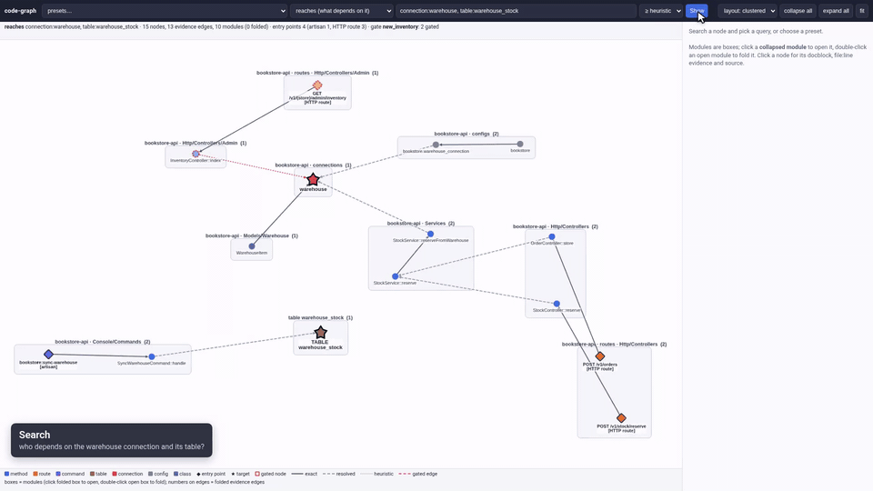
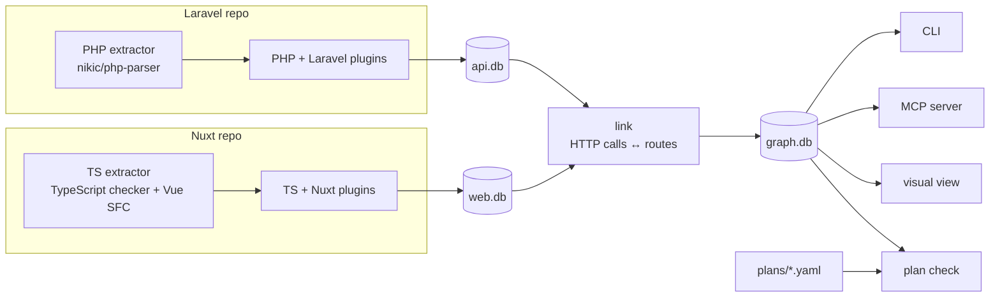

# code-graph

**A deterministic dependency graph for Laravel, Django, NestJS, Next.js, Express, Nuxt, Flutter, Rust, C and C++ codebases, so you (and your AI agent) can see everything a change touches before you make it.**

Ask "what depends on this table, connection, config key or method?" and get every caller, route, command and page that
reaches it, each hop backed by `file:line` evidence. It runs locally on your source files, and every answer is exact,
deterministic and reproducible.

> **Status:** beta. Laravel (PHP), Django (Python), TypeScript/JavaScript (Nuxt/Vue, NestJS, Next.js,
> Express/Fastify/Koa/Hono), Flutter (Dart), Rust, C and C++ are
> supported natively; other languages can be imported through SCIP. See [Limitations](#limitations).

[](docs/media/cg-view-demo.mp4)

[](docs/media/cg-terminal-demo.mp4)

[Quickstart](#quickstart-about-2-minutes-on-the-bundled-sample-apps) · [Demo](#demo) · [What you get](#what-you-get) · [Supported stacks](#supported-languages-and-frameworks) · [Prerequisites](#prerequisites-per-language) · [AI agents](#using-it-with-an-ai-agent) · [Docs](#documentation)

## Why

Say you need to change how stock is reserved from a second database, the `warehouse` connection. Four files mention
`warehouse` by name. code-graph shows you the whole picture before you edit:

- the two public routes, `POST /v1/orders` and `POST /v1/stock/reserve`, that reach that code through a service two
  calls away, in files whose text never mentions "warehouse";
- the change's siblings: add a column in `Admin\BookController::store`, and it points you to the separate `update`
  path and the admin form that also write `books` ([planned changes](#4-a-planned-change-layer) list these for you);
- which callers run on every request and which are a one-off console command;
- the route that touches the warehouse only in a branch a feature flag has already switched off.

code-graph builds the graph from parsers and the type checker (calls, routes, models, tables, columns, config, HTTP
calls from the frontend to backend routes), so every answer is a real path you can follow hop by hop:

```text
$ cg reaches connection:warehouse table:warehouse_stock --db out/graph.db --no-paths   # abridged
== RUNTIME (reached from http_route / scheduled / queue_job / listener / message_handler): 4 functions/methods
  [Http/Controllers]
    App\Http\Controllers\OrderController::store  depth=3 conf=resolved  http_route(1)
    App\Http\Controllers\StockController::reserve  depth=3 conf=resolved  http_route(1)
  [Services]
    App\Services\StockService::reserve  depth=2 conf=resolved  http_route(2)
    App\Services\StockService::reserveFromWarehouse  depth=1 conf=resolved  http_route(2)

== OPERATOR-ONLY (artisan_command / admin_panel / cli_command; one-off import & provisioning): 1 functions/methods
  [Console/Commands]
    App\Console\Commands\SyncWarehouseCommand::handle  depth=1 conf=resolved  artisan_command(1)

== GATED UNDER SCENARIO 'new_inventory' (dead when the scenario holds; live otherwise): 1 functions/methods
  [Http/Controllers/Admin]
    App\Http\Controllers\Admin\InventoryController::index  gated_target  entry-when-off: http_route(1)
```

Every edge is either `exact` (syntactically certain), `resolved` (needed type or name resolution) or `heuristic`
(clearly labelled fallback), so you know how far to trust each answer.

## Quickstart (about 2 minutes, on the bundled sample apps)

The repo ships two small fictional apps: `examples/bookstore-api` (Laravel) and `examples/bookstore-web` (Nuxt).
The same bookstore also exists as `examples/bookstore-nest`, `examples/bookstore-next` and `examples/bookstore-express`
(see [docs/ts-frameworks.md](docs/ts-frameworks.md)).

Watch it first: the [setup video (MP4, about 80 s)](docs/media/cg-setup-demo.mp4) runs these exact steps on a fresh
clone, from install to first query, the visual view and connecting an AI agent through MCP.

**Prerequisites** for this quickstart: Python 3.11+, PHP 8.2+ with Composer 2, and Node.js 20+. Other stacks need
other tools; see [Prerequisites per language](#prerequisites-per-language).

**Install** (about 15 seconds; all dependencies go inside the checkout):

```bash
git clone https://github.com/cyberchronos00/code-graph.git && cd code-graph
python3 -m venv .venv && .venv/bin/pip install "mcp>=2.2" pyyaml pytest protobuf tree-sitter tree-sitter-rust tree-sitter-c tree-sitter-cpp
(cd codegraph/plugins/php/extractor && composer install)
(cd codegraph/plugins/ts/extractor && npm ci)
cg() { .venv/bin/python -m codegraph.cli "$@"; }    # shorthand used below
```

**Index both apps and link them into one graph** (a few seconds):

```bash
mkdir -p out
cg index examples/bookstore-api --name bookstore-api --gates examples/bookstore.gates.json --db out/api.db > out/api.stats.json
cg index examples/bookstore-web --name bookstore-web --db out/web.db > out/web.stats.json
cg link --backend out/api.db --frontend out/web.db \
        --backend-name bookstore-api --frontend-name bookstore-web --db out/graph.db > out/link.stats.json
```

**Ask it something:**

```bash
cg reaches connection:warehouse table:warehouse_stock --db out/graph.db   # who depends on the warehouse DB?
cg impact StockService::reserve --db out/graph.db                         # what calls this, from which routes?
cg path page:/reports/:id table:orders --db out/graph.db                  # frontend page -> DB table, hop by hop
cg resolutions timezone --db out/graph.db                                 # where is "timezone" decided?
cg routes --writes --db out/graph.db                                      # which routes write data, and with which guards?
cg plan check preorders --plans-dir examples/plans --db out/graph.db      # what does this planned change miss?
.venv/bin/python -m pytest -q tests/                                      # 130 tests
```

**The same bookstore in other stacks.** Each sample indexes on its own; PHP is only needed for Laravel and Node only
for the TypeScript stacks:

```bash
cg index examples/bookstore-nest --name bookstore-nest --db out/nest.db > out/nest.stats.json        # NestJS
cg index examples/bookstore-next --name bookstore-next --db out/next.db > out/next.stats.json        # Next.js
cg link --backend out/nest.db --frontend out/next.db --backend-name bookstore-nest \
        --frontend-name bookstore-next --db out/nn.db > out/nn.stats.json
cg api-calls all --db out/nn.db                    # every client call with its matched Nest route and handler

cg index examples/bookstore-django --name bookstore-django --db out/django.db > out/django.stats.json   # Django
cg routes --writes --unguarded --db out/django.db  # routes that write data without an auth guard

cg index examples/rust-kvstore --gates examples/native.gates.json --db out/kv.db > out/kv.stats.json   # Rust
cg reaches kv_core::store::Store::get --db out/kv.db     # dyn/generic dispatch, grouped RUNTIME / LIBRARY API / DEV
cg downstream kv::main --db out/kv.db                     # env keys, unsafe, features and cfgs the binary touches
```

`examples/bookstore-express` (Express), `examples/bookstore-flutter` (Flutter, links to the Django sample),
`examples/c-ringbuf` (C) and `examples/cpp-eventbus` (C++) work the same way. Rust, C and C++ index in exact mode when
rust-analyzer or scip-clang is installed, and in a labelled `heuristic` mode otherwise; C/C++ setup, including the
compile database, is in [docs/native.md](docs/native.md#c-and-c).

`scripts/reproduce.sh` runs the same steps end to end (into `out/graph.db`), and also writes HTML views and (if Chrome is installed)
screenshots to `out/`.

## Demo

Five short videos on the bundled sample apps; everything they show is also written out as text in this README.

- [Setup (MP4, about 80 s)](docs/media/cg-setup-demo.mp4): a fresh clone, the quickstart install, the first index of
  both apps, a first `impact` query, `cg serve` for the visual view, and a Cursor `mcp.json` entry that connects your
  AI agent.
- [Terminal demo (MP4, about 60 s)](docs/media/cg-terminal-demo.mp4): index and link both apps, then `reaches` on the
  warehouse connection (runtime, operator-only and gated groups), `path` from a Nuxt page to a column, `impact` and
  `plan check`.
- [Visual view demo (MP4, about 40 s)](docs/media/cg-view-demo.mp4): `cg serve` in a browser. Search for the warehouse
  connection, select a node to highlight its evidence paths and open its source, then switch to the planned-change
  overlay for the `preorders` plan and inspect two items it still needs to cover.

  [](docs/media/cg-view-demo.mp4)
- [AI agent over MCP (MP4, about 195 s)](docs/media/cg-agent-demo.mp4): a live Cursor CLI agent with cg connected.
  It finds every route that writes data without auth in one `routes` call, catches what the `preorders` plan leaves
  out before any code is written, then fixes all of it in the same chat (guards every unprotected write route and
  implements the plan including what it missed), re-indexes and re-checks with the graph, with `git diff --stat` at
  the end. Part of that last run is shown at 6× speed, marked on screen. Before the plan question it shows the plan itself,
  [examples/plans/preorders.yaml](examples/plans/preorders.yaml). Nothing is replayed: the answers stream in live from
  the model.
- [The same agent without code-graph (MP4, about 285 s)](docs/media/cg-agent-baseline.mp4): the same model and the
  same three tasks in a fresh copy with no MCP server, using its built-in search and file reading, in one live take.
  It ends with the [comparison card](docs/media/cg-agent-compare.png).

All five are scripted, so they can be re-recorded: `scripts/demo/record-setup.sh`, `scripts/demo/record-terminal.sh`
and `scripts/demo/record-agent.sh` (`record-agent.sh baseline` for the take without code-graph; vhs tapes), and
`scripts/demo/record-view.sh` (Playwright).

**Comparison** (same agent, Cursor CLI with GPT-5.4 Mini at medium reasoning; results checked against the code):

| task | with code-graph | without code-graph |
|---|---|---|
| 1. Security review: write routes without auth (3 in the code) | 12 s, 1 tool call, 46.4k in / 894 out tokens; found 3 of 3 | 40 s, 39 tool calls, 205.7k in / 4.6k out; found 3 of 3 |
| 2. Plan check: gaps in `preorders.yaml` (7 in the code) | 13 s, 1 tool call, 52.6k in / 1.1k out; found 7 of 7, plus the failed `auth:api` requirement | 26 s, 6 tool calls, 50.6k in / 3.6k out; found 3 of 7 (admin update path, `UpdateBookRequest`, mobile client) |
| 3. Fix everything: guard the routes, implement the plan, verify | 228 s, 56 tool calls (10 cg), 2,071.5k in / 23.5k out; routes guarded 3 of 3; gaps fixed 7 of 7 (6 in code, the mobile client recorded in the plan since the client is not in the copy); re-indexed, `plan_check` 0 missing, verify OK | 119 s, 50 tool calls, 1,127.1k in / 14.6k out; routes guarded 3 of 3; gaps fixed 4 of 7 (not the Filament form, the customer on the `POST /v1/orders` path, the mobile client); verified by re-reading the route file |
| total | 253 s, 58 tool calls, 2,170.5k in / 25.5k out | 185 s, 95 tool calls, 1,383.4k in / 22.8k out |

Time, tool calls and tokens come from the Cursor CLI's own usage report (input tokens include cached input); one live
take per side, so the numbers vary between runs. Results were checked against the code afterwards: both copies pass
`php -l` and re-index after task 3, and both also put `POST /v1/stock/reserve` behind `auth:api` as the plan requires.
The 7 plan gaps are the admin update path, `UpdateBookRequest`, `Book::$fillable`, the API and Filament
`BookResource`, the `POST /v1/orders` path (the customer passed to `reserve`) and the mobile client.

## What you get

### 1. A CLI for impact questions

`reaches`, `impact`, `downstream`, `path`, `writers`, `siblings`, `routes`, `search`, `api-calls`, `channels` and `tests`
all work on one SQLite graph, and across repos once the frontend and backend are linked. Every hop shows its evidence:

```text
$ cg path page:/reports/:id table:orders --db out/graph.db
page:app/pages/reports/[id].vue
          -CALLS[resolved @ bookstore-web/app/pages/reports/[id].vue:10]-> function:app/composables/useReports.ts#useReports.fetchTop
          -HTTP_CALLS[resolved @ bookstore-web/app/composables/useReports.ts:9]-> http:GET /api/v1/main/admin/reports/top
          -MATCHES_ROUTE[resolved @ bookstore-api/routes/api.php:11]-> route:GET /v1/{store}/admin/reports/top
          -ROUTES_TO[exact @ bookstore-api/routes/api.php:11]-> method:App\Http\Controllers\ReportController::top
          -CALLS[resolved @ bookstore-api/app/Http/Controllers/ReportController.php:21]-> method:App\Services\SalesReportService::report
          -CALLS[exact @ bookstore-api/app/Services/SalesReportService.php:12]-> method:App\Services\SalesReportService::build
          -READS_COLUMN[resolved @ bookstore-api/app/Services/SalesReportService.php:19]-> column:orders.placed_at
```

It also traces *values*. `resolutions <concept>` finds every place a value is picked through a fallback chain, shows
where the chains disagree, and checks whether the frontend actually sends the key:

```text
$ cg resolutions timezone --db out/graph.db      # abridged
[A] input:timezone > column:orders.customer_timezone > setting:locale.timezone > column:stores.default_timezone > 'UTC'
[B] input:timezone > setting:reports.timezone > 'UTC'
  [A] vs [B]: same up to input:timezone; then [A] column:orders.customer_timezone vs [B] setting:reports.timezone
  GET /api/v1/main/admin/reports/top  -> chain B
       => 'timezone': never sent (builder key is conditional and no call site passes it)
```

When a page passes a key that its request helper never puts on the request, `path` and `resolutions` point it out:

```text
note: sent but not forwarded: date_from (passed @ bookstore-web/app/pages/reports/[id].vue:10; the request built @ bookstore-web/app/composables/useReports.ts:9 sends only category_id, mode, timezone)
```

`routes` lists every route that reaches a write, a table or any other node, together with its middleware, guards and
auth checks (Laravel middleware, Nest guards, Express middleware, Next.js `middleware.ts`, django-ninja `auth=`,
Django and DRF access checks):

```text
$ cg routes --writes --db out/graph.db --no-paths      # abridged
routes reaching a write (any table): 4 of 9 routes
auth guard: 1 with, 3 without (auth = guard name matches the auth pattern; name-based)

DELETE /v1/{store}/admin/reports/{report}  @bookstore-api/routes/api.php:14  NO AUTH
    guards: (none)
    writes orders via Services\SalesReportService::remove conf=resolved
    called from: page:app/pages/index.vue @index.vue:4
POST /v1/orders  @bookstore-api/routes/api.php:21
    guards: auth:api [auth]
    writes books via Services\StockService::recordSale conf=resolved
```

Add `--unguarded` for the routes without an auth-like guard, or `--missing auth:api` for the routes without one
specific guard. Routes whose only check is a shared secret or signature (webhook signature middleware, Laravel
`signed` URLs) are shown as `SECRET-CHECKED` rather than `NO AUTH`. When a query comes back empty, the answer says why
and suggests the next query to run.

`channels` answers who may join a broadcast channel, what publishes on it and which client code listens, and `tests`
lists the tests that exercise a symbol, route or table (test code never counts as a caller in the other queries):

```text
$ cg channels board.42 --no-source --db out/graph.db      # abridged
== channel board.{board}  [private]  @ backend/routes/channels.php:22
WHO CAN JOIN
  auth route route:POST /api/broadcasting/auth  middleware=['api', 'auth:sanctum']  (from ->withBroadcasting bootstrap/app.php:7)
  channel class App\Broadcasting\BoardChannel (join())
    CALLS Support\BoardAccess::visibleBoardIds  @ backend/app/Broadcasting/BoardChannel.php:12 [exact]
PUBLISHED BY (1)
  event:App\Events\TaskMoved  name=board.{board_id}  [private]  broadcastOn @ app/Events/TaskMoved.php:22
      dispatched by Http\Controllers\TaskController::move @ backend/app/Http/Controllers/TaskController.php:22  http_route(1)
LISTENED TO BY (1)
  board.{boardId}  [private]  events: TaskMoved  (exact)
      subscribed in useBoardRealtime (useBoardRealtime.ts) @ frontend/app/composables/useBoardRealtime.ts:5
      pages: page:app/pages/boards/[id].vue

$ cg tests 'PATCH /api/tasks/{task}/move' --no-paths --db out/graph.db
targets: 1 node(s): route:PATCH /tasks/{task}/move
tests: 2 direct, 0 transitive (of 10 test cases in the graph)

== DIRECT (the test code itself calls / requests the target): 2
  TaskMoveTest::test_moving_a_task_updates_its_state  [phpunit] backend/tests/Feature/TaskMoveTest.php:17  depth=2 conf=exact
  board page > moving a task through the API  [playwright] frontend/e2e/board.spec.ts:9  depth=2 conf=resolved
```

Details: [docs/channels-and-tests.md](docs/channels-and-tests.md).

Full reference: [docs/cli.md](docs/cli.md) · value facts: [docs/value-facts.md](docs/value-facts.md)

### 2. An MCP server for AI agents

The same queries as MCP tools (`reaches`, `impact`, `siblings`, `path`, `downstream`, `routes`, `search`, `api_calls`,
`channels`, `tests_covering`, `resolutions`, `plan_check`, `index`, `coverage`, …), so an agent can check the blast radius before it edits. Replies are compact,
use repo-relative paths, and `plan_check` starts with a summary (`details=true` for the full report). It runs locally
over stdio:

```text
> impact(method="StockService::reserve")
transitive callers: 2; entry points: 2
## http_route (2)
  POST /v1/orders  ROUTES_TO@api.php:21 → CALLS@OrderController.php:17~r → Services\StockService::reserve
  POST /v1/stock/reserve  ROUTES_TO@api.php:19 → CALLS@StockController.php:16~r → Services\StockService::reserve
```

Setup: [Using it with an AI agent](#using-it-with-an-ai-agent) · all tools: [docs/mcp.md](docs/mcp.md)

### 3. A visual view

`cg serve --db out/graph.db --plans-dir examples/plans` starts a local, read-only web view at
`http://127.0.0.1:8177/`. It draws the same query results as a graph grouped by repo and module. Click a node to see
its source snippet and evidence edges. `cg viz-export …` writes the same view as a single HTML file that opens from
disk.

More: [docs/viz.md](docs/viz.md)

### 4. A planned-change layer

Write the agreed scope of a change as a small YAML plan: new columns, methods to modify, forbidden paths, required
middleware. `plan check` compares it with the real graph and lists what the plan forgot, before anyone writes code:

```text
$ cg plan check preorders --plans-dir examples/plans --db out/graph.db      # abridged
summary: refs 15/15 resolve | MISSING FROM PLAN 10 | review 7 | covered 7 | forbidden paths present 1 | open findings touching 2 (unlinked 1) | requirements failed 1
  require POST /v1/stock/reserve [auth:api]: MISSING auth:api
  - [admin_surface] Filament\Resources\BookResource::form: Filament form for Book; saves bypass the graph's WRITES edges
  - [model_fillable] Book::$fillable lacks preorder_until (mass assignment would drop it)
  - [table_writer] Admin\BookController::update: writes books (price, stock, title); must set/keep new preorder_until
  - [external_client] client:example/bookstore-mobile/pages/cart.vue: POST /stock/reserve -> POST /v1/stock/reserve
  forbid no-warehouse-for-preorders: path STILL PRESENT
```

After you implement and re-index, `plan check --verify` confirms that the planned nodes and edges now exist, the
forbidden paths are gone or guarded, and the requirements are met.

Workflow: [Planned changes](#planned-changes) · schema and checks: [docs/plans.md](docs/plans.md)

## Supported languages and frameworks

Every edge carries a confidence: `exact` (the parser or compiler saw it), `resolved` (needed type or name resolution)
or `heuristic` (a labelled name-based fallback). The **mode** column says where each stack gets its references from.

| language / framework | mode | what is modelled |
|---|---|---|
| PHP | exact + resolved (nikic/php-parser, type inference) | classes, methods, calls with type inference, properties, interfaces, traits |
| Laravel | exact + resolved | routes + middleware, Eloquent models → tables/columns, migrations, DB connections, config/env, commands, scheduler, jobs, events/listeners, container bindings, FormRequests, settings reads, broadcast channels (auth callbacks, `broadcastOn()`, the auth route), PHPUnit / Pest tests |
| Filament | resolved | admin panels as entry points, resource `$model` binding |
| TypeScript / Vue | exact + resolved (TypeScript checker, Vue SFC compiler) | modules, functions, components, template usage, HTTP calls (fetch, `$fetch`, axios, ofetch / ky instances) with base URLs from runtime config and env, Laravel Echo / pusher-js channel subscriptions, Vitest / Jest / Playwright / Cypress tests |
| Nuxt | exact + resolved | file-based page routes, layouts, auto-imports, global components, Pinia stores, i18n keys; source at the root, `app/` or `src/`; clean checkouts without `.nuxt` |
| NestJS | exact + resolved | modules, controllers + routes (global prefix, URI versioning, `RouterModule`), DI (class / `@Inject` tokens, `useClass`/`useExisting`/`useFactory`/`useValue`), guards / interceptors / pipes, DTO fields, GraphQL resolvers, `@Cron`/`@Interval`, Bull/BullMQ, `@OnEvent`, microservice and WebSocket handlers, nest-commander (operator), TypeORM / Mongoose / Prisma / Kysely tables, `ConfigService` / env |
| Next.js | exact + resolved | app router (pages, layouts, `route.ts` handlers, dynamic / catch-all segments, route groups, parallel / intercepting routes), pages router + `pages/api`, server actions, `middleware.ts` matchers, `basePath` / rewrites, env incl. `NEXT_PUBLIC_*`, in-repo client → handler links |
| Express, Fastify, Koa, Hono | exact + resolved | routes, router mounting chains across files (`use`, `register({prefix})`, `route`, `basePath`), route and router-level middleware, Fastify schemas |
| JavaScript (CommonJS / ESM) | resolved (TS checker with `allowJs`) | the same extractor; resolution follows what the checker infers |
| Python | resolved (stdlib `ast`, import resolution, type inference) + heuristic fallback | modules, classes, functions, calls |
| Django | resolved + heuristic fallback | urls.py (path/re_path/include/namespaces), class/function views, view access checks (`login_required`, permission decorators, access mixins), models → tables/columns/relations, ORM reads/writes, settings/env (os.environ, getenv, django-environ), signals, management commands, admin |
| django-ninja | resolved | NinjaAPI/Router/`add_router` prefixes, operations with path params, `auth=`, request/response Schema and ModelSchema fields |
| Django REST Framework | resolved | routers, ViewSets (+ `@action`), APIView/generic views, `permission_classes`, serializer fields |
| Celery / Channels | resolved | tasks + `.delay`/`.apply_async` dispatches; websocket routing to consumers |
| Dart | resolved (package:analyzer parse, declared types) + heuristic fallback | libraries/parts, classes, methods, functions, calls with import resolution |
| Flutter | resolved + heuristic fallback | widgets/State, bloc/cubit events → handlers → states → UI, Navigator/go_router/auto_route pages, HTTP calls (package:http, Dio, dart:io, Retrofit/Chopper), WebSockets, json_serializable/freezed and hand-written JSON keys |
| Rust | **exact** with rust-analyzer (SCIP); **heuristic** without | crates, modules, `pub` API, traits → impls (dyn/generic dispatch), bins, tests, benches, examples, `build.rs`, FFI, `unsafe`, `#[cfg(feature)]` gates, env keys, `#[tokio::main]`, axum/actix routes ([docs/native.md](docs/native.md)) |
| C | **exact** with scip-clang + `compile_commands.json`; **heuristic** without | translation units, includes, `main` and test entry points, exported API, `#if` gates, `getenv` keys, macros ([docs/native.md](docs/native.md#c-and-c)) |
| C++ | **exact** with scip-clang + `compile_commands.json`; **heuristic** without | the C facts plus namespaces, classes, overloads, virtual dispatch (overrides and implementations) ([docs/native.md](docs/native.md#c-and-c)) |
| Frontend → backend | resolved, or heuristic for suffix-only matches | client HTTP calls (fetch, axios, `$fetch`/ofetch, ky, SWR, OpenAPI-generated clients, Dart clients) matched to Laravel, Django, Nest, Next and Express routes (`link`), plus a request/response field check |
| Go, Java | via SCIP (experimental) | definitions and references imported from an existing SCIP index |

## Prerequisites per language

Python 3.11+ (tested with 3.13) runs the indexer, CLI and MCP server for every stack. Each language adds:

| language | you need | install |
|---|---|---|
| all | Python packages | `.venv/bin/pip install "mcp>=2.2" pyyaml pytest protobuf` |
| PHP / Laravel | PHP 8.2+ (tested 8.4), Composer 2 | `(cd codegraph/plugins/php/extractor && composer install)` |
| TypeScript / JavaScript (Nuxt, Vue, NestJS, Next.js, Express, Fastify, Koa, Hono) | Node.js 20+ (tested 20.19), npm | `(cd codegraph/plugins/ts/extractor && npm ci)` |
| Python / Django | nothing extra (stdlib `ast`) | — |
| Dart / Flutter | Dart SDK 3.x (tested 3.13); the target project needs no `pub get` | `dart` on PATH or `$DART`; the extractor's packages are fetched on first use |
| Rust | tree-sitter packages; rust-analyzer for exact mode (any 2024+ release) | `.venv/bin/pip install tree-sitter tree-sitter-rust`, `rustup component add rust-analyzer` |
| C / C++ | tree-sitter packages; scip-clang 0.4+ and a `compile_commands.json` for exact mode | `.venv/bin/pip install tree-sitter tree-sitter-c tree-sitter-cpp`; scip-clang and compile database: [docs/native.md](docs/native.md#c-and-c) |
| Go, Java | an existing SCIP index | `cg index <root> --scip index.scip` |

## How it works



1. **Extract.** A PHP process and a Node process each parse the whole project once and emit JSON facts. They work
   purely from source files, so indexing is safe and side-effect free on any checkout.
2. **Resolve.** Language plugins build symbol tables and resolve calls through types. Framework plugins add what
   the framework implies (a route points to a controller, a model maps to a table, `->where('col')` reads a column).
3. **Gate (optional).** With a gates file, branches that a feature-flag scenario switches off are marked, and the
   edges inside them are kept and tagged as gated.
4. **Store.** Nodes and edges go into SQLite, and each edge keeps its `file:line` and confidence. Entry points
   (routes, commands, jobs, listeners, pages) are tagged so every result can say *who* reaches it.
5. **Query.** Recursive walks over the edges that propagate dependency, with the shortest evidence path rebuilt for
   each result.

Details: [docs/architecture.md](docs/architecture.md) · schema: [docs/schema.md](docs/schema.md)

## Using it with an AI agent

Add the server to your MCP host. Most hosts, Cursor and Claude Desktop among them, accept an `mcpServers` entry.
Replace `/path/to/code-graph` with your checkout:

```json
{
  "mcpServers": {
    "code-graph": {
      "command": "/path/to/code-graph/.venv/bin/python",
      "args": ["-m", "codegraph.mcp_server", "--db", "out/graph.db",
               "--gates", "examples/bookstore.gates.json", "--plans", "examples/plans"],
      "cwd": "/path/to/code-graph"
    }
  }
}
```

A workflow that works well:

1. **Before editing**, the agent calls `reaches` on the table, column, connection or config key it plans to touch,
   and `impact` / `siblings` on the methods. It now has the full list of callers, entry points and parallel code
   paths, with evidence.
2. **For a non-trivial change**, it writes a plan (`plans/<name>.yaml`) and runs `plan_check`. It then resolves each
   *missing from plan* item by adding it to the plan, marking it covered, or marking it out of scope with a reason.
3. **After editing**, it calls `index` to rebuild the graph and runs `plan_check(verify=true)`.
4. **In its summary**, it quotes the `file:line` evidence so a reviewer can check the claims.

A ready-to-paste rules snippet is in [docs/mcp.md](docs/mcp.md#suggested-agent-instructions), and the Cursor CLI
setup (`.cursor/cli.json`, `agent mcp enable`, print mode) is in [docs/mcp.md](docs/mcp.md#cursor-cli). When a
language is not covered (see `coverage`), empty replies say so and tell the agent to fall back to its normal search.
To see an agent at work, watch the [agent demo (MP4)](docs/media/cg-agent-demo.mp4).

## Planned changes

1. Write `plans/<name>.yaml` with the agreed scope, linked issues, forbidden paths and requirements.
2. Run `cg plan validate <name>`, then `cg plan check <name>` (add `--plans-dir DIR` if your plans live
   elsewhere). Work through **MISSING FROM PLAN** and link any **unlinked findings**.
3. Run `cg plan baseline <name>`. This records a hash of each target's current source.
4. Implement, then re-index (`cg index` + `cg link`, or the MCP `index` tool).
5. Run `cg plan check <name> --verify`. It reports `verify_ok` when the planned nodes, edges, forbidden paths and
   requirements all check out, and lists any completeness gaps still open.

`cg viz-plan <name>` (or the **plan overlay** mode in `serve`) draws the plan on top of the real graph: planned items
in green, gaps in magenta, forbidden paths in red. See [docs/plans.md](docs/plans.md).

## Configuration

code-graph indexes a project with zero configuration. The optional inputs are:

- **Gate scenarios** (`index --gates FILE`): name a feature-flag state, e.g. "`features.new_inventory.enabled` is
  true", and code that this state switches off is reported in its own gated group, apart from live code:

  ```json
  {"scenarios": [{"name": "new_inventory", "setting_accessors": ["getSetting"],
                  "true_settings": ["features.new_inventory.enabled"], "false_settings": []}]}
  ```

- **Viz presets** (`serve --presets FILE`): a JSON list of canned queries for the preset menu,
  `{id, label, mode, specs[, sinks]}`.
- **Plans directory** (`--plans-dir DIR`; MCP server: `--plans DIR`). The default is `plans/`.

Everything else (environment variables, screenshot tooling): [docs/configuration.md](docs/configuration.md)

## Limitations

The scope as of v0.3, so you know how far each answer reaches. The full list is in [docs/limitations.md](docs/limitations.md).

- **Coverage.** `cg index` prints which languages it covered (`exact`, `heuristic`, `skipped` when a toolchain
  such as `php` or `node` is missing, `unsupported` with file counts); `cg coverage` and the MCP `coverage` tool show
  it later. A missing indexer never fails the whole index, and agents are told to fall back to normal search for code
  cg does not cover. See [docs/limitations.md](docs/limitations.md#coverage-and-missing-indexers).
- **Static analysis.** Types are flow-insensitive, and generics are outside the current scope. When a receiver has no
  resolved type, a unique-method-name fallback fills the gap and is labelled `heuristic`.
- **String-built names** (dynamic table, column or URL names) become placeholders such as `{param}` or
  `tenant_{store.id}`, or stay unresolved.
- **Python/Dart are parsed, not type-checked.** Calls through untyped parameters, `**kwargs`, dynamic dispatch
  (`getattr`, DI containers, Riverpod/Provider lookups without a type) fall back to `heuristic` or stay unresolved.
  GraphQL APIs (graphene/strawberry) and Django template rendering are not modelled.
- **Next to index:** seeders, `Artisan::command` closures, observers fired by model writes, Nuxt server routes, and
  navigation edges (`NuxtLink`, `navigateTo`).
- **Broadcast channels** are read from `Broadcast::channel` and `broadcastOn()`; names cg cannot evaluate keep a
  `{?}` segment, and Livewire Echo listeners are not client subscriptions. A channel's checks are the calls its
  callback makes. See [docs/channels-and-tests.md](docs/channels-and-tests.md#limits).
- **Tests** are found by naming conventions and never count as callers. Transitive test paths are static, so a browser
  test that stubs the API still reaches the backend through the page it opens.
- **Base URLs** from runtime config and env are folded into endpoint paths when the value is in the repo (`nuxt.config`
  defaults, `.env`, `.env.example`, `||` defaults in code); values set only at deploy time stay an unknown origin.
  A Nuxt checkout without `.nuxt` is indexed with generated stand-ins for its own auto-imports and components.
- **TS frameworks:** `link` compares method and path for Nest/Express routes. Nest providers are global (one module
  scope). Express middleware order is tracked within one file. Monorepo roots are indexed per app. Details:
  [docs/ts-frameworks.md](docs/ts-frameworks.md#limitations).
- **Gate scenarios** cover one scenario per index and flags read through settings accessors. Paths behind middleware
  gates or flags stored in properties are reported as live, which keeps results conservative.
- **Rust / C / C++:** exact mode uses rust-analyzer or scip-clang (and, for C/C++, a compile database) and reflects
  one build configuration: inactive `#if` branches and macro-generated items get nodes, and their references come from
  heuristic mode. Heuristic mode covers about half of the calls in generic or template-heavy code. See
  [docs/limitations.md](docs/limitations.md#rust-c-and-c).
- **Route guards** come from route definitions and global enhancers (Nest `APP_GUARD` / `useGlobal*`, Express
  `app.use`). Whether a guard counts as auth is decided by its name (extendable with `--auth-pattern`). Details:
  [docs/limitations.md](docs/limitations.md#route-guards-and-forwarded-keys).
- **Sent but not forwarded** keys are found for call sites that pass an object literal to a request helper whose
  request keys are statically known (one call level).
- **Plans** use a fixed set of named completeness rules. Verify mode checks the graph; free-text intent is for the
  reviewer to judge.
- **The visual view** is comfortable up to a few hundred nodes. It is a local tool without auth: keep it on
  `127.0.0.1`, or share a `viz-export` file.

## Roadmap

Ideas we are exploring after v0.3. Feedback on priorities is welcome.

- Packaging: `pip install` with a `code-graph` console script, plus prebuilt extractor deps.
- Nuxt server routes (Nitro) and navigation edges.
- Payload checks in `link` (Nest DTO / Fastify schema fields against client request keys), and Nest module scoping.
- Laravel: seeders, closure commands, and observers triggered by model writes; Livewire Echo listeners as channel
  subscriptions.
- Multiple gate scenarios per index, and middleware-level gates.
- Tested SCIP recipes for Go and Java.
- Rust/C/C++: macro-expanded items, function-pointer dataflow, Bazel and Meson autodetection.
- Route guards: Laravel kernel middleware groups and Django's `MIDDLEWARE` setting shown on each route.
- More HTTP clients beyond fetch, axios, ofetch and ky, and response-field modelling for the TypeScript client (setting → API response → client state); GraphQL APIs.

## Documentation

| doc | contents |
|---|---|
| [docs/cli.md](docs/cli.md) | every command and option, query target syntax |
| [docs/mcp.md](docs/mcp.md) | MCP tools, client config, agent instructions |
| [docs/architecture.md](docs/architecture.md) | invariants, codemap, plugin interface, how queries, the TS/Nuxt plugin and `link` work |
| [docs/schema.md](docs/schema.md) | SQLite tables, node kinds, edge kinds, confidence, entry kinds |
| [docs/native.md](docs/native.md) | Rust, C and C++: install, compile database, modes, facts, entry kinds, query specs, gates, env vars, validation numbers |
| [docs/ts-frameworks.md](docs/ts-frameworks.md) | NestJS, Next.js and Express-style layers, validation on public projects |
| [docs/value-facts.md](docs/value-facts.md) | request keys, settings, fallback chains, `resolutions` |
| [docs/channels-and-tests.md](docs/channels-and-tests.md) | broadcast channels (`channels`) and test coverage (`tests`) |
| [docs/plans.md](docs/plans.md) | plan schema, every check, verify mode, overlay legend |
| [docs/viz.md](docs/viz.md) | visual view and static export |
| [docs/configuration.md](docs/configuration.md) | gates, presets, plans dir, environment variables |
| [docs/limitations.md](docs/limitations.md) | all known gaps |
| [docs/validation.md](docs/validation.md) | results on public Django and Flutter projects |
| [CONTRIBUTING.md](CONTRIBUTING.md) | dev setup, running the 130 tests, adding a plugin |
| [docs/mcp/sample_outputs.md](docs/mcp/sample_outputs.md) | raw output of every MCP tool on the sample apps |
| [docs/media/](docs/media) | demo videos: [setup](docs/media/cg-setup-demo.mp4), [terminal](docs/media/cg-terminal-demo.mp4), [visual view](docs/media/cg-view-demo.mp4), [AI agent over MCP](docs/media/cg-agent-demo.mp4), [without code-graph](docs/media/cg-agent-baseline.mp4) (recording scripts in `scripts/demo/`) |

## Contributing

Issues and pull requests are welcome. See [CONTRIBUTING.md](CONTRIBUTING.md) for the dev setup, how to run the
tests, how to add a language or framework plugin, and what a PR needs. In short: tests pass, edges stay
deterministic, and every new edge carries `file:line` evidence and an honest confidence level.

To report a security issue, please use GitHub's private vulnerability reporting; see [SECURITY.md](SECURITY.md).

## License

[MIT](LICENSE). Vendored third-party files keep their own licenses: Cytoscape.js, cytoscape-fcose, cose-base and
layout-base are MIT (`codegraph/viz/static/vendor/VERSIONS.txt`).
